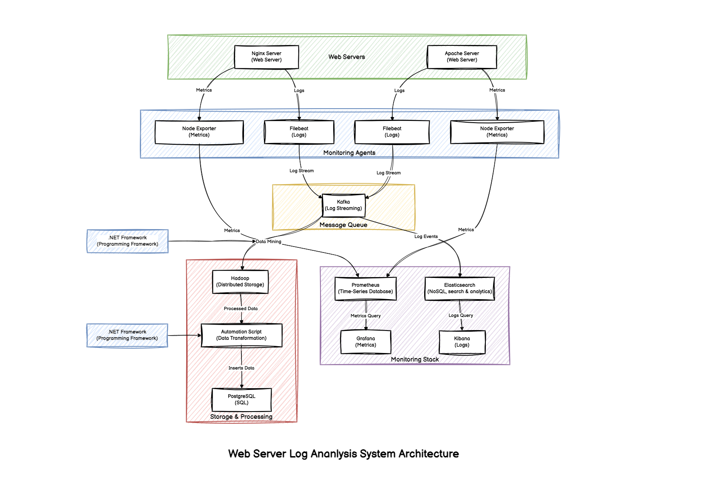

# Web Server Log Analysis System

## Table of Contents
- [Web Server Log Analysis System](#web-server-log-analysis-system)
  - [Table of Contents](#table-of-contents)
  - [Overview](#overview)
  - [Architecture](#architecture)
  - [Setup and Deployment](#setup-and-deployment)
    - [Download and Install Required Software](#download-and-install-required-software)
      - [Install Git](#install-git)
      - [Install Vagrant](#install-vagrant)
      - [Install VirtualBox](#install-virtualbox)
      - [Install .NET Core SDK](#install-net-core-sdk)
      - [Install Python and Virtualenv](#install-python-and-virtualenv)
    - [Clone the Repository](#clone-the-repository)
    - [Provision Virtual Machines](#provision-virtual-machines)
  - [Kafka Log Consumption](#kafka-log-consumption)
    - [Consume Nginx Logs](#consume-nginx-logs)
      - [Step 1: Login to Kafka VM](#step-1-login-to-kafka-vm)
      - [Step 2: Consume Nginx Logs from Kafka Topic](#step-2-consume-nginx-logs-from-kafka-topic)
    - [Consume Apache Logs](#consume-apache-logs)
      - [Step 1: Login to second instance of Kafka VM](#step-1-login-to-second-instance-of-kafka-vm)
      - [Step 2: Consume Apache Logs from Kafka Topic](#step-2-consume-apache-logs-from-kafka-topic)
  - [Running .NET Core Kafka Consumer](#running-net-core-kafka-consumer)
  - [Generating Logs](#generating-logs)
    - [Generate Nginx Logs](#generate-nginx-logs)
      - [Step 1: Login to Nginx VM](#step-1-login-to-nginx-vm)
      - [Step 2: Clone and Set Up Fake Log Generator](#step-2-clone-and-set-up-fake-log-generator)
    - [Generate Apache Logs](#generate-apache-logs)
      - [Step 1: Login to Apache VM](#step-1-login-to-apache-vm)
      - [Step 2: Clone and Set Up Fake Log Generator](#step-2-clone-and-set-up-fake-log-generator-1)
  - [Service Endpoints](#service-endpoints)
  - [Destroy the VMs](#destroy-the-vms)
  - [Notes](#notes)

---

## Overview
The **Web Server Log Analysis System** is designed to collect, process, and analyze web server logs using Kafka, Hadoop, and .NET Core applications. Logs from Nginx and Apache are consumed via Kafka and stored in Hadoop for further processing. Monitoring and visualization are handled using Prometheus, Grafana, and Kibana.

## Architecture



---

## Setup and Deployment
### Download and Install Required Software

#### Install Git
To install Git on Windows, download and install Git from [git-scm.com](https://git-scm.com/downloads).

#### Install Vagrant
To install Vagrant on Windows, download and install Vagrant from [vagrantup.com](https://www.vagrantup.com/).

#### Install VirtualBox
To install VirtualBox on Windows, download and install VirtualBox from [virtualbox.org](https://www.virtualbox.org/wiki/Downloads).

#### Install .NET Core SDK
To install .NET Core SDK on Windows, download and install .NET Core SDK from [dotnet.microsoft.com](https://dotnet.microsoft.com/download).

#### Install Python and Virtualenv
To install Python on Windows, download and install Python from [python.org](https://www.python.org/downloads/).
After installing Python, open a command prompt and install Virtualenv:
```sh
pip install virtualenv
```

### Clone the Repository
To clone the repository, run the following command:

```sh
cd ~/Documents/
git clone https://github.com/nehachitodkar/web-server-log-analysis.git
cd web-server-log-analysis
```
### Provision Virtual Machines
To set up the required virtual machines, run the following command:

```sh
vagrant up storage; vagrant up kafka; vagrant up hadoop; vagrant up monitoring; vagrant up nginx; vagrant up apache
```

---

## Kafka Log Consumption
## Running .NET Core Kafka Consumer
Open a new terminal to start the .NET Core application that reads Kafka messages and stores them in HDFS:

```sh
cd Documents\web-server-log-analysis\KafkaConsumerApp
dotnet run
```

---

## Generating Logs

### Generate Nginx Logs
#### Step 1: Login to Nginx VM
Run below command in a separate terminal,
```sh
cd Documents\web-server-log-analysis\
vagrant ssh nginx
```
Run below command once you're in the terminal, to switch to root user
```sh
sudo su
```
#### Step 2: Clone and Set Up Fake Log Generator
```sh
git clone https://github.com/iamnehakoli/fake-log-generator.git
virtualenv dev
source dev/bin/activate
cd fake-log-generator
pip install -r requirements.txt
python fake-log-generator.py -n 0 --log-type NGINX --sleep 1
```

### Generate Apache Logs
#### Step 1: Login to Apache VM
Run below command in a separate terminal,
```sh
cd Documents\web-server-log-analysis\
vagrant ssh apache
```
Run below command once you're in the terminal, to switch to root user
```sh
sudo su
```
#### Step 2: Clone and Set Up Fake Log Generator
```sh
git clone https://github.com/iamnehakoli/fake-log-generator.git
virtualenv dev
source dev/bin/activate
cd fake-log-generator
pip install -r requirements.txt
python fake-log-generator.py -n 0 --log-type APACHE --sleep 1
```

---

## Service Endpoints
- **Nginx (nginx)**: [http://192.168.56.10](http://192.168.56.10)
- **Apache (apache)**: [http://192.168.56.11](http://192.168.56.11)
- **Kafka (kafka)**: [http://192.168.56.12:8080](http://192.168.56.12:8080)
- **Prometheus (storage)**: [http://192.168.56.13:9090](http://192.168.56.13:9090/targets)
- **Elasticsearch (storage)**: [http://192.168.56.13:9200](http://192.168.56.13:9200)
- **Hadoop (hadoop)**: [http://192.168.56.14:9870](http://192.168.56.14:9870)
- **Grafana (monitoring)**: [http://192.168.56.15:3000](http://192.168.56.15:3000)
- **Kibana (monitoring)**: [http://192.168.56.15:5601](http://192.168.56.15:5601)

---

## Destroy the VMs
To destroy a specific VM run below command from the web-server-log-analysis directory,
```sh
vagrant destroy <vm-name> # e.g. vagrant destroy nginx
```
To destroy all the VMs
```sh
vagrant destroy -f
```

---

## Notes
- Ensure all virtual machines are up and running before proceeding.
- Kafka is used to consume logs from Nginx and Apache and store them in Hadoop.
- Grafana, Kibana, and Prometheus provide monitoring and visualization capabilities.
