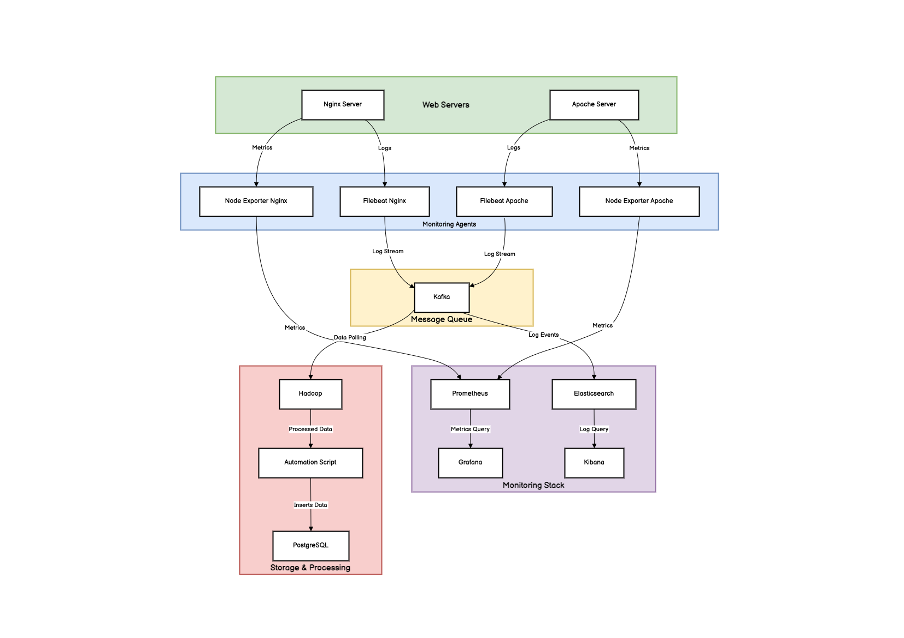

# Web Server Log Analysis System

## Table of Contents
- [Overview](#overview)
- [Architecture](#architecture)
- [Setup and Deployment](#setup-and-deployment)
  - [Provision Virtual Machines](#provision-virtual-machines)
- [Kafka Log Consumption](#kafka-log-consumption)
  - [Consume Nginx Logs](#consume-nginx-logs)
  - [Consume Apache Logs](#consume-apache-logs)
- [Running .NET Core Kafka Consumer](#running-net-core-kafka-consumer)
- [Generating Logs](#generating-logs)
  - [Generate Nginx Logs](#generate-nginx-logs)
  - [Generate Apache Logs](#generate-apache-logs)
- [Service Endpoints](#service-endpoints)
- [Notes](#notes)

---

## Overview
The **Web Server Log Analysis System** is designed to collect, process, and analyze web server logs using Kafka, Hadoop, and .NET Core applications. Logs from Nginx and Apache are consumed via Kafka and stored in Hadoop for further processing. Monitoring and visualization are handled using Prometheus, Grafana, and Kibana.

## Architecture



---

## Setup and Deployment

### Provision Virtual Machines
To set up the required virtual machines, run the following command:

```sh
vagrant up storage; vagrant up kafka; vagrant up hadoop; vagrant up monitoring; vagrant up nginx; vagrant up apache
```

---

## Kafka Log Consumption
### Consume Nginx Logs
#### Step 1: Login to Kafka VM
```sh
vagrant ssh kafka
```

#### Step 2: Consume Nginx Logs from Kafka Topic
```sh
/opt/kafka/bin/kafka-console-consumer.sh --bootstrap-server 192.168.56.12:9092 --topic nginx-logs --from-beginning
```

### Consume Apache Logs
#### Step 1: Login to Kafka VM
```sh
vagrant ssh kafka
```

#### Step 2: Consume Apache Logs from Kafka Topic
```sh
/opt/kafka/bin/kafka-console-consumer.sh --bootstrap-server 192.168.56.12:9092 --topic apache-logs --from-beginning
```

---

## Running .NET Core Kafka Consumer

To start the .NET Core application that reads Kafka messages and stores them in HDFS:

```sh
cd C:\Users\neha.koli\Desktop\msc-project\latest-dev\KafkaConsumerApp
dotnet run
```

---

## Generating Logs

### Generate Nginx Logs
#### Step 1: Login to Nginx VM
```sh
vagrant ssh nginx
```

#### Step 2: Clone and Set Up Fake Log Generator
```sh
sudo apt install git virtualenv -y
git clone https://github.com/nehachitodkar/fake-log-generator.git
virtualenv dev
source dev/bin/activate
cd fake-log-generator
pip install -r requirements.txt
python fake-log-generator.py -n 0 --log-type NGINX --min-delay 1 --max-delay 100 | sudo tee /var/log/nginx/access.log
```

### Generate Apache Logs
#### Step 1: Login to Apache VM
```sh
vagrant ssh apache
```

#### Step 2: Clone and Set Up Fake Log Generator
```sh
sudo apt install git virtualenv -y
git clone https://github.com/nehachitodkar/fake-log-generator.git
virtualenv dev
source dev/bin/activate
cd fake-log-generator
pip install -r requirements.txt
python fake-log-generator.py -n 0 --log-type APACHE --min-delay 1 --max-delay 100 | sudo tee /var/log/apache2/access.log
```

---

## Service Endpoints
- **Nginx**: [http://192.168.56.10](http://192.168.56.10)
- **Apache**: [http://192.168.56.11](http://192.168.56.11)
- **Prometheus**: [http://192.168.56.13:9090](http://192.168.56.13:9090/targets)
- **Elasticsearch**: [http://192.168.56.13:9200](http://192.168.56.13:9200)
- **Grafana**: [http://192.168.56.15:3000](http://192.168.56.15:3000)
- **Kibana**: [http://192.168.56.15:5601](http://192.168.56.15:5601)
- **Hadoop**: [http://192.168.56.14:9870](http://192.168.56.14:9870)

---

## Notes
- Ensure all virtual machines are up and running before proceeding.
- Kafka is used to consume logs from Nginx and Apache and store them in Hadoop.
- Grafana, Kibana, and Prometheus provide monitoring and visualization capabilities.